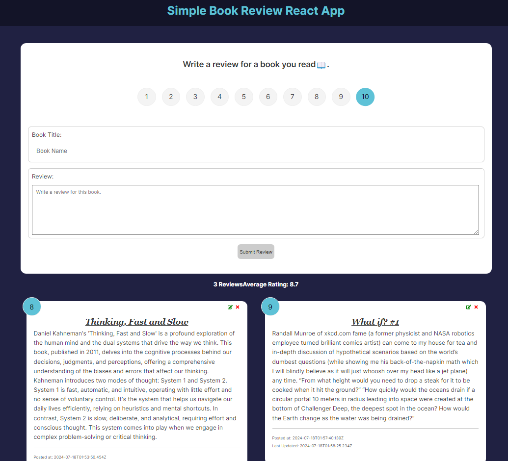

# Book Review React App

## Overview
A Simple book review application built with ReactJS, NodeJS, Express & MongoDB.

## Built With
- ReactJS
- NodeJS
- Express
- MongoDB

## Live Demo

Check out the live site [Book Review React App](https://yangbeibei88.github.io/BookReview-React-App/).

## Features
- Frontend component is built with React JS.
- Backend is built-with NodeJS, Express and MongoDB
- Built with Vite

## License
The code is licensed under [Apache 2.0](https://www.apache.org/licenses/LICENSE-2.0.txt).

## Contact
- Beibei Yang [beibeiyang88@hotmail.com](mailto:beibeiyang88@hotmail.com)
